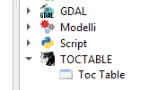
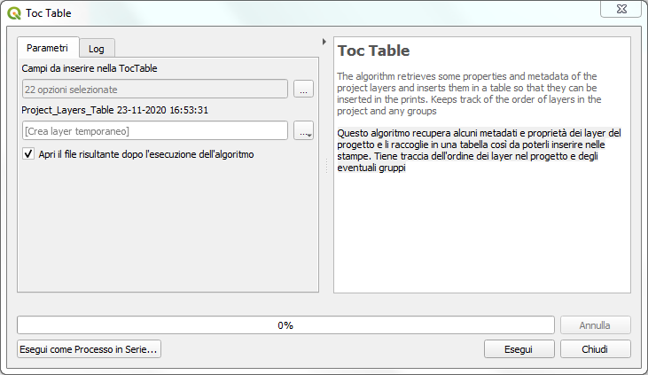
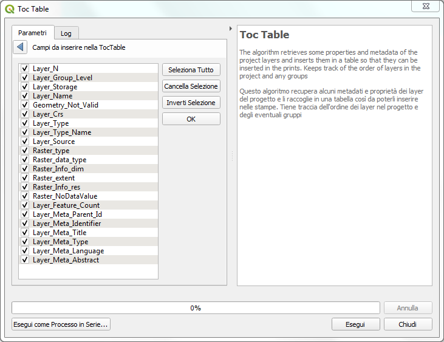

# TocTable
## QGIS Plugin per processing
Recupera alcuni metadati e proprietà dei layer del progetto e li inserisce in una tabella così da poterli utilizzare come riferimenti. Tiene anche traccia dell'ordine dei layer nel progetto e degli eventuali gruppi

### Installazione

Per installarlo basta che scarichiate lo zip del repo e da QGIS fate installa plugin da zip. Spero a breve sia disponibile nel repository ufficiale di QGIS.

### Finestra processing
Il plugin, una volta caricato, compare negli script di processing nella cartella TOCTABLE

La finestra permette la scelta dei campi da riportare in tabella tra i 22 presenti che risultano selezionati e la loro eventuale riorganizzazione per trascinamento

Una volta selezionati i campi di interesse e avviato il plugin si otterrà la tabella compilata.

### Ringraziamenti
[QGIS.org](https://www.qgis.org/it/site/) - [Totò Fiandaca](https://pigrecoinfinito.com/) 